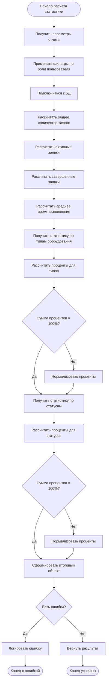

# Алгоритмы и блок-схемы системы учета заявок на ремонт климатического оборудования

## Содержание
1. [Основной алгоритм учета заявок](#основной-алгоритм-учета-заявок)
2. [Алгоритм расчета статистики](#алгоритм-расчета-статистики)
3. [Алгоритм аутентификации пользователей](#алгоритм-аутентификации-пользователей)
4. [Алгоритм назначения заявок на мастерские](#алгоритм-назначения-заявок-на-мастерские)
5. [Алгоритм генерации QR-кодов](#алгоритм-генерации-qr-кодов)
6. [Спецификации модулей](#спецификации-модулей)

---

## Основной алгоритм учета заявок

### Описание
Основной алгоритм системы управляет жизненным циклом заявок на ремонт климатического оборудования от создания до завершения.

### Блок-схема (по ГОСТ 19.701)

```mermaid
flowchart TD
    A([Начало]) --> B[Получить запрос пользователя]
    B --> C{Тип запроса?}
    
    C -->|Создание заявки| D[Валидация данных заявки]
    C -->|Просмотр заявок| E[Проверка прав доступа]
    C -->|Обновление статуса| F[Проверка прав на изменение]
    C -->|Генерация отчета| G[Сбор данных для отчета]
    
    D --> H{Данные корректны?}
    H -->|Нет| I[Вернуть ошибку валидации]
    H -->|Да| J[Генерировать номер заявки]
    J --> K[Сохранить заявку в БД]
    K --> L[Установить статус "Новая"]
    L --> M[Уведомить операторов]
    
    E --> N{Доступ разрешен?}
    N -->|Нет| O[Вернуть ошибку доступа]
    N -->|Да| P[Фильтровать данные по роли]
    P --> Q[Вернуть список заявок]
    
    F --> R{Права есть?}
    R -->|Нет| S[Вернуть ошибку прав]
    R -->|Да| T[Обновить статус заявки]
    T --> U[Записать в историю изменений]
    U --> V{Статус "Завершена"?}
    V -->|Да| W[Генерировать QR-код для оценки]
    V -->|Нет| X[Уведомить участников]
    
    G --> Y[Применить фильтры по роли]
    Y --> Z[Рассчитать статистику]
    Z --> AA[Форматировать данные]
    
    I --> BB([Конец])
    M --> BB
    O --> BB
    Q --> BB
    S --> BB
    W --> BB
    X --> BB
    AA --> BB
```

### Псевдокод
```
АЛГОРИТМ УчетЗаявок
ВХОД: запрос_пользователя, данные_сессии
ВЫХОД: результат_операции

НАЧАЛО
    тип_запроса = определить_тип_запроса(запрос_пользователя)
    
    ВЫБОР тип_запроса
        СЛУЧАЙ "создание_заявки":
            ЕСЛИ валидировать_данные_заявки(данные_заявки) ТО
                номер_заявки = генерировать_номер_заявки()
                сохранить_заявку(данные_заявки, номер_заявки)
                установить_статус("Новая")
                уведомить_операторов()
                ВОЗВРАТ успех
            ИНАЧЕ
                ВОЗВРАТ ошибка_валидации
            КОНЕЦ_ЕСЛИ
            
        СЛУЧАЙ "просмотр_заявок":
            ЕСЛИ проверить_права_доступа(пользователь, "просмотр") ТО
                заявки = получить_заявки_по_роли(пользователь)
                ВОЗВРАТ заявки
            ИНАЧЕ
                ВОЗВРАТ ошибка_доступа
            КОНЕЦ_ЕСЛИ
            
        СЛУЧАЙ "обновление_статуса":
            ЕСЛИ проверить_права_изменения(пользователь, заявка) ТО
                обновить_статус_заявки(заявка_id, новый_статус)
                записать_в_историю(заявка_id, изменения)
                ЕСЛИ новый_статус = "Завершена" ТО
                    генерировать_qr_код(заявка_id)
                КОНЕЦ_ЕСЛИ
                ВОЗВРАТ успех
            ИНАЧЕ
                ВОЗВРАТ ошибка_прав
            КОНЕЦ_ЕСЛИ
            
        СЛУЧАЙ "генерация_отчета":
            данные = собрать_данные_отчета(фильтры_роли)
            статистика = рассчитать_статистику(данные)
            ВОЗВРАТ форматировать_отчет(статистика)
    КОНЕЦ_ВЫБОР
КОНЕЦ
```

---

## Алгоритм расчета статистики

### Описание
Алгоритм вычисляет различные статистические показатели системы: общее количество заявок, активные заявки, завершенные заявки, среднее время выполнения, распределение по типам оборудования и статусам.

### Блок-схема



### Псевдокод
```
АЛГОРИТМ РасчетСтатистики
ВХОД: фильтры_роли, параметры_отчета
ВЫХОД: объект_статистики

НАЧАЛО
    // Основные показатели
    общее_количество = ВЫПОЛНИТЬ_ЗАПРОС("SELECT COUNT(*) FROM repair_requests WHERE " + фильтры_роли)
    активные = ВЫПОЛНИТЬ_ЗАПРОС("SELECT COUNT(*) FROM repair_requests WHERE status_id IN (1,2,3) AND " + фильтры_роли)
    завершенные = ВЫПОЛНИТЬ_ЗАПРОС("SELECT COUNT(*) FROM repair_requests WHERE status_id = 5 AND " + фильтры_роли)
    
    // Среднее время выполнения
    среднее_время = ВЫПОЛНИТЬ_ЗАПРОС("SELECT AVG(julianday(completion_date) - julianday(start_date)) FROM repair_requests WHERE completion_date IS NOT NULL AND " + фильтры_роли)
    
    // Статистика по типам оборудования
    типы_оборудования = ВЫПОЛНИТЬ_ЗАПРОС("SELECT et.type_name, COUNT(r.request_id) as count FROM equipment_types et LEFT JOIN repair_requests r ON et.type_id = r.type_id WHERE " + фильтры_роли + " GROUP BY et.type_id ORDER BY count DESC")
    
    // Расчет процентов для типов
    ДЛЯ КАЖДОГО тип В типы_оборудования
        ЕСЛИ общее_количество > 0 ТО
            тип.процент = ОКРУГЛИТЬ((тип.количество / общее_количество) * 100)
        ИНАЧЕ
            тип.процент = 0
        КОНЕЦ_ЕСЛИ
    КОНЕЦ_ДЛЯ
    
    // Нормализация процентов
    сумма_процентов = СУММА(тип.процент ДЛЯ тип В типы_оборудования)
    ЕСЛИ сумма_процентов ≠ 100 И общее_количество > 0 ТО
        коэффициент = 100 / сумма_процентов
        ДЛЯ КАЖДОГО тип В типы_оборудования
            тип.процент = ОКРУГЛИТЬ(тип.процент * коэффициент)
        КОНЕЦ_ДЛЯ
    КОНЕЦ_ЕСЛИ
    
    // Аналогично для статусов заявок
    статусы = ВЫПОЛНИТЬ_ЗАПРОС("SELECT rs.status_name, rs.status_color, COUNT(r.request_id) as count FROM request_statuses rs LEFT JOIN repair_requests r ON rs.status_id = r.status_id WHERE " + фильтры_роли + " GROUP BY rs.status_id ORDER BY count DESC")
    
    // Формирование результата
    результат = {
        общее_количество: общее_количество,
        активные: активные,
        завершенные: завершенные,
        среднее_время: ОКРУГЛИТЬ(среднее_время * 10) / 10,
        статистика_типов: типы_оборудования,
        статистика_статусов: статусы
    }
    
    ВОЗВРАТ результат
КОНЕЦ
```

---

## Алгоритм аутентификации пользователей

### Описание
Алгоритм проверяет учетные данные пользователя и создает сессию при успешной аутентификации.

### Блок-схема

```mermaid
flowchart TD
    A([Начало аутентификации]) --> B[Получить логин и пароль]
    B --> C[Валидация входных данных]
    C --> D{Данные корректны?}
    D -->|Нет| E[Вернуть ошибку валидации]
    D -->|Да| F[Поиск пользователя в БД]
    F --> G{Пользователь найден?}
    G -->|Нет| H[Вернуть ошибку "Пользователь не найден"]
    G -->|Да| I{Пользователь активен?}
    I -->|Нет| J[Вернуть ошибку "Аккаунт заблокирован"]
    I -->|Да| K[Проверить хеш пароля]
    K --> L{Пароль верен?}
    L -->|Нет| M[Вернуть ошибку "Неверный пароль"]
    L -->|Да| N[Создать сессию пользователя]
    N --> O[Записать в лог успешного входа]
    O --> P[Перенаправить на главную страницу]
    
    E --> Q([Конец с ошибкой])
    H --> Q
    J --> Q
    M --> Q
    P --> R([Конец успешно])
```

---

## Алгоритм назначения заявок на мастерские

### Описание
Алгоритм назначает заявки на ремонт специалистам (мастерам) с учетом их загрузки и специализации.

### Блок-схема

```mermaid
flowchart TD
    A([Начало назначения]) --> B[Получить ID заявки и ID мастера]
    B --> C[Проверить права пользователя]
    C --> D{Права есть?}
    D -->|Нет| E[Вернуть ошибку доступа]
    D -->|Да| F[Проверить существование заявки]
    F --> G{Заявка существует?}
    G -->|Нет| H[Вернуть ошибку "Заявка не найдена"]
    G -->|Да| I[Проверить статус заявки]
    I --> J{Статус позволяет назначение?}
    J -->|Нет| K[Вернуть ошибку "Неверный статус"]
    J -->|Да| L[Проверить существование мастера]
    L --> M{Мастер существует и активен?}
    M -->|Нет| N[Вернуть ошибку "Мастер недоступен"]
    M -->|Да| O[Назначить мастера на заявку]
    O --> P[Изменить статус на "В процессе ремонта"]
    P --> Q[Записать в историю изменений]
    Q --> R[Уведомить мастера]
    R --> S[Уведомить клиента]
    
    E --> T([Конец с ошибкой])
    H --> T
    K --> T
    N --> T
    S --> U([Конец успешно])
```

---

## Алгоритм генерации QR-кодов

### Описание
Алгоритм создает QR-коды для завершенных заявок, содержащие ссылку на форму оценки качества работ.

### Блок-схема

```mermaid
flowchart TD
    A([Начало генерации QR]) --> B[Получить ID завершенной заявки]
    B --> C[Проверить статус заявки]
    C --> D{Статус = "Завершена"?}
    D -->|Нет| E[Вернуть ошибку "Заявка не завершена"]
    D -->|Да| F[Сформировать URL для оценки]
    F --> G[Генерировать QR-код]
    G --> H{QR-код создан успешно?}
    H -->|Нет| I[Логировать ошибку]
    H -->|Да| J[Конвертировать в Base64]
    J --> K[Вернуть QR-код]
    
    E --> L([Конец с ошибкой])
    I --> L
    K --> M([Конец успешно])
```

---

## Спецификации модулей

### Модуль расчета статистики

**Название:** StatisticsCalculator  
**Назначение:** Расчет статистических показателей системы  

**Входные данные:**
- `userRole` (String) - роль пользователя для фильтрации данных
- `userId` (Integer) - ID пользователя для персональной статистики
- `dateFrom` (Date, optional) - начальная дата периода
- `dateTo` (Date, optional) - конечная дата периода

**Выходные данные:**
```javascript
{
  totalRequests: Integer,        // Общее количество заявок
  activeRequests: Integer,       // Активные заявки
  completedRequests: Integer,    // Завершенные заявки
  avgCompletionTime: Float,      // Среднее время выполнения (дни)
  equipmentStats: [              // Статистика по типам оборудования
    {
      type_name: String,
      count: Integer,
      percentage: Integer
    }
  ],
  statusStats: [                 // Статистика по статусам
    {
      status_name: String,
      status_color: String,
      count: Integer,
      percentage: Integer
    }
  ]
}
```

**Исключительные ситуации:**
- DatabaseConnectionError - ошибка подключения к БД
- InvalidUserRoleError - некорректная роль пользователя
- DataValidationError - ошибка валидации входных данных

### Модуль аутентификации

**Название:** AuthenticationManager  
**Назначение:** Управление аутентификацией и авторизацией пользователей  

**Входные данные:**
- `login` (String) - логин пользователя
- `password` (String) - пароль пользователя

**Выходные данные:**
```javascript
{
  success: Boolean,              // Успешность аутентификации
  user: {                        // Данные пользователя (при успехе)
    user_id: Integer,
    full_name: String,
    user_type: String,
    phone: String
  },
  error: String                  // Сообщение об ошибке (при неудаче)
}
```

**Исключительные ситуации:**
- InvalidCredentialsError - неверные учетные данные
- UserNotFoundError - пользователь не найден
- AccountDisabledError - аккаунт заблокирован
- DatabaseError - ошибка работы с БД

### Модуль управления заявками

**Название:** RequestManager  
**Назначение:** Управление жизненным циклом заявок на ремонт  

**Входные данные для создания заявки:**
- `clientId` (Integer) - ID клиента
- `equipmentType` (Integer) - тип оборудования
- `equipmentModel` (Integer) - модель оборудования
- `problemDescription` (String) - описание проблемы
- `priorityLevel` (Integer) - уровень приоритета (1-5)

**Выходные данные:**
```javascript
{
  success: Boolean,              // Успешность операции
  requestNumber: String,         // Номер созданной заявки
  requestId: Integer,            // ID заявки
  error: String                  // Сообщение об ошибке (при неудаче)
}
```

**Исключительные ситуации:**
- ValidationError - ошибка валидации данных
- DuplicateRequestError - дублирование заявки
- DatabaseError - ошибка работы с БД
- PermissionDeniedError - недостаточно прав

---

## Требования к реализации

1. **Производительность:** Все алгоритмы должны выполняться не более 5 секунд при объеме данных до 10000 заявок
2. **Надежность:** Обязательная обработка всех исключительных ситуаций
3. **Безопасность:** Валидация всех входных данных, защита от SQL-инъекций
4. **Масштабируемость:** Возможность работы с увеличивающимся объемом данных
5. **Логирование:** Обязательное логирование всех критических операций

---

*Документ составлен в соответствии с ГОСТ 19.701-90 "Схемы алгоритмов, программ, данных и систем"*