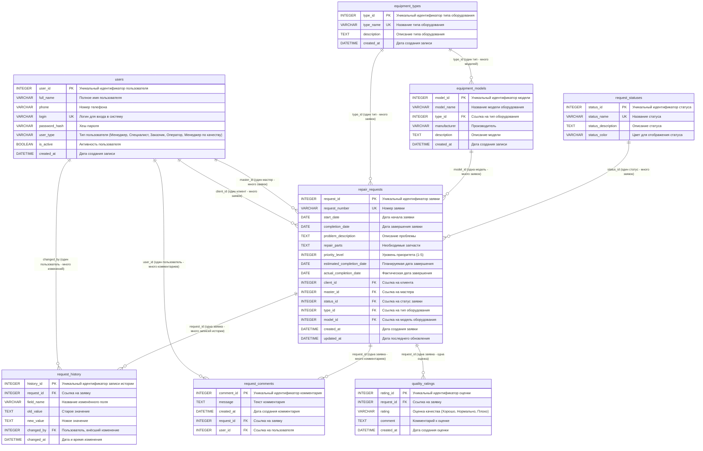

# ER-диаграмма базы данных системы управления заявками на ремонт климатического оборудования

## Описание

Данная ER-диаграмма представляет структуру базы данных в третьей нормальной форме (3НФ) с обеспечением ссылочной целостности. База данных предназначена для управления заявками на ремонт климатического оборудования.

## ER-диаграмма

## Описание сущностей

### 1. users (Пользователи)
**Назначение:** Хранение информации о всех пользователях системы
**Ключевые атрибуты:**
- `user_id` - первичный ключ
- `login` - уникальный логин
- `user_type` - роль пользователя в системе

### 2. equipment_types (Типы оборудования)
**Назначение:** Классификация климатического оборудования по типам
**Ключевые атрибуты:**
- `type_id` - первичный ключ
- `type_name` - уникальное название типа

### 3. equipment_models (Модели оборудования)
**Назначение:** Конкретные модели оборудования каждого типа
**Ключевые атрибуты:**
- `model_id` - первичный ключ
- `type_id` - внешний ключ на equipment_types

### 4. request_statuses (Статусы заявок)
**Назначение:** Определение возможных статусов заявок
**Ключевые атрибуты:**
- `status_id` - первичный ключ
- `status_name` - уникальное название статуса

### 5. repair_requests (Заявки на ремонт)
**Назначение:** Основная сущность - заявки на ремонт оборудования
**Ключевые атрибуты:**
- `request_id` - первичный ключ
- `request_number` - уникальный номер заявки
- Множественные внешние ключи для связи с другими сущностями

### 6. request_comments (Комментарии к заявкам)
**Назначение:** Комментарии пользователей к заявкам
**Ключевые атрибуты:**
- `comment_id` - первичный ключ
- `request_id` - внешний ключ на repair_requests
- `user_id` - внешний ключ на users

### 7. quality_ratings (Оценки качества)
**Назначение:** Оценки качества выполненных работ
**Ключевые атрибуты:**
- `rating_id` - первичный ключ
- `request_id` - внешний ключ на repair_requests

### 8. request_history (История изменений)
**Назначение:** Аудит изменений в заявках
**Ключевые атрибуты:**
- `history_id` - первичный ключ
- `request_id` - внешний ключ на repair_requests
- `changed_by` - внешний ключ на users

## Кардинальности связей

1. **users → repair_requests (client_id)**: 1:M (один клиент может иметь много заявок)
2. **users → repair_requests (master_id)**: 1:M (один мастер может обслуживать много заявок)
3. **equipment_types → equipment_models**: 1:M (один тип может иметь много моделей)
4. **equipment_types → repair_requests**: 1:M (один тип может быть в многих заявках)
5. **equipment_models → repair_requests**: 1:M (одна модель может быть в многих заявках)
6. **request_statuses → repair_requests**: 1:M (один статус может быть у многих заявок)
7. **repair_requests → request_comments**: 1:M (одна заявка может иметь много комментариев)
8. **repair_requests → quality_ratings**: 1:1 (одна заявка имеет одну оценку)
9. **repair_requests → request_history**: 1:M (одна заявка может иметь много записей истории)
10. **users → request_comments**: 1:M (один пользователь может оставить много комментариев)
11. **users → request_history**: 1:M (один пользователь может внести много изменений)

## Ссылочная целостность

Все внешние ключи настроены с соответствующими ограничениями:
- **CASCADE** - для зависимых записей (комментарии, история, оценки удаляются при удалении заявки)
- **SET NULL** - для необязательных связей (мастер может быть не назначен)
- **RESTRICT** - для критически важных связей (нельзя удалить тип оборудования, если есть связанные заявки)

## Соответствие 3НФ

База данных соответствует третьей нормальной форме:
1. **1НФ**: Все атрибуты атомарны, нет повторяющихся групп
2. **2НФ**: Все неключевые атрибуты полностью функционально зависят от первичного ключа
3. **3НФ**: Отсутствуют транзитивные зависимости между неключевыми атрибутами

## Индексы

Созданы индексы для оптимизации часто используемых запросов:
- По внешним ключам для ускорения JOIN операций
- По полям поиска (login, дата создания заявки)
- По полям фильтрации (статус, тип пользователя)