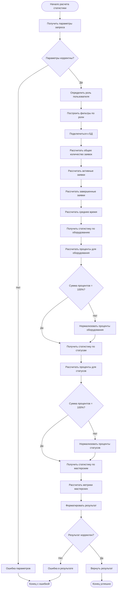
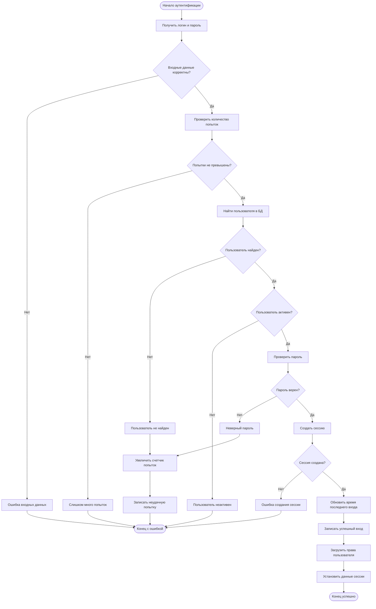
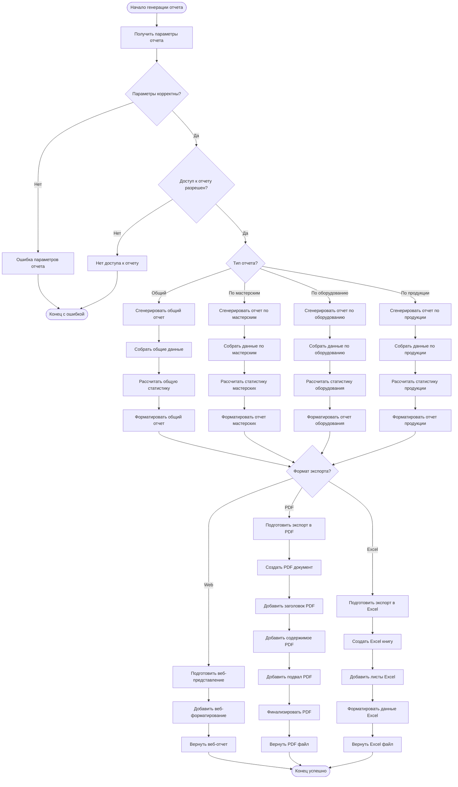

# Блок-схемы системы учета заявок (ГОСТ 19.701-90)

## Содержание
1. [Основная блок-схема системы](#основная-блок-схема-системы)
2. [Блок-схема расчета статистики](#блок-схема-расчета-статистики)
3. [Блок-схема обработки заявок](#блок-схема-обработки-заявок)
4. [Блок-схема аутентификации](#блок-схема-аутентификации)
5. [Блок-схема генерации отчетов](#блок-схема-генерации-отчетов)

---

## Основная блок-схема системы

### Общий алгоритм работы системы управления заявками

```mermaid
flowchart TD
    Start([Начало работы системы]) --> Init[Инициализация системы]
    Init --> DBConnect{Подключение к БД успешно?}
    
    DBConnect -->|Нет| DBError[Ошибка подключения к БД]
    DBError --> LogError[Записать в лог ошибки]
    LogError --> Retry{Повторить попытку?}
    Retry -->|Да| DBConnect
    Retry -->|Нет| SystemStop([Остановка системы])
    
    DBConnect -->|Да| ServerStart[Запуск веб-сервера]
    ServerStart --> WaitRequest[Ожидание запроса]
    
    WaitRequest --> RequestReceived[Получен запрос]
    RequestReceived --> ParseRequest[Парсинг запроса]
    ParseRequest --> AuthCheck{Требуется аутентификация?}
    
    AuthCheck -->|Нет| ProcessPublic[Обработка публичного запроса]
    AuthCheck -->|Да| ValidateSession{Сессия валидна?}
    
    ValidateSession -->|Нет| ShowLogin[Показать форму входа]
    ShowLogin --> WaitRequest
    
    ValidateSession -->|Да| CheckPermissions{Права доступа есть?}
    CheckPermissions -->|Нет| AccessDenied[Доступ запрещен]
    AccessDenied --> SendResponse[Отправить ответ]
    
    CheckPermissions -->|Да| RouteRequest{Тип запроса?}
    
    RouteRequest -->|Создание заявки| CreateRequest[Создать заявку]
    RouteRequest -->|Просмотр заявок| ViewRequests[Показать заявки]
    RouteRequest -->|Обновление статуса| UpdateStatus[Обновить статус]
    RouteRequest -->|Генерация отчета| GenerateReport[Сгенерировать отчет]
    RouteRequest -->|Экспорт PDF| ExportPDF[Экспортировать в PDF]
    
    CreateRequest --> ValidateData{Данные корректны?}
    ValidateData -->|Нет| ValidationError[Ошибка валидации]
    ValidateData -->|Да| SaveRequest[Сохранить заявку]
    SaveRequest --> NotifyUsers[Уведомить пользователей]
    
    ViewRequests --> ApplyFilters[Применить фильтры по роли]
    ApplyFilters --> FetchData[Получить данные из БД]
    FetchData --> FormatData[Форматировать данные]
    
    UpdateStatus --> CheckStatusPermissions{Права на изменение?}
    CheckStatusPermissions -->|Нет| PermissionError[Ошибка прав]
    CheckStatusPermissions -->|Да| UpdateDB[Обновить БД]
    UpdateDB --> LogChange[Записать в историю]
    LogChange --> CheckCompleted{Статус "Завершена"?}
    CheckCompleted -->|Да| GenerateQR[Сгенерировать QR-код]
    CheckCompleted -->|Нет| NotifyChange[Уведомить об изменении]
    
    GenerateReport --> CalculateStats[Рассчитать статистику]
    CalculateStats --> FormatReport[Форматировать отчет]
    
    ExportPDF --> PrepareData[Подготовить данные]
    PrepareData --> CreatePDF[Создать PDF документ]
    CreatePDF --> SendFile[Отправить файл]
    
    ProcessPublic --> SendResponse
    ValidationError --> SendResponse
    NotifyUsers --> SendResponse
    FormatData --> SendResponse
    PermissionError --> SendResponse
    GenerateQR --> SendResponse
    NotifyChange --> SendResponse
    FormatReport --> SendResponse
    SendFile --> SendResponse
    
    SendResponse --> WaitRequest
```

---

## Блок-схема расчета статистики

### Алгоритм расчета статистических показателей



---

## Блок-схема обработки заявок

### Алгоритм создания и обработки заявок на ремонт

```mermaid
flowchart TD
    StartRequest([Начало обработки заявки]) --> GetRequestType{Тип операции?}
    
    GetRequestType -->|Создание| ValidateCreateData[Валидация данных создания]
    GetRequestType -->|Обновление| ValidateUpdateData[Валидация данных обновления]
    GetRequestType -->|Просмотр| ValidateViewData[Валидация прав просмотра]
    GetRequestType -->|Удаление| ValidateDeleteData[Валидация прав удаления]
    
    ValidateCreateData --> CheckCreatePermissions{Права на создание?}
    CheckCreatePermissions -->|Нет| CreatePermError[Ошибка прав создания]
    CheckCreatePermissions -->|Да| GenerateNumber[Сгенерировать номер заявки]
    
    GenerateNumber --> CheckDuplicate{Номер уникален?}
    CheckDuplicate -->|Нет| GenerateNumber
    CheckDuplicate -->|Да| SetInitialStatus[Установить статус "Новая"]
    
    SetInitialStatus --> SaveToDB[Сохранить в БД]
    SaveToDB --> CreateSuccess{Сохранение успешно?}
    CreateSuccess -->|Нет| SaveError[Ошибка сохранения]
    CreateSuccess -->|Да| NotifyOperators[Уведомить операторов]
    NotifyOperators --> LogCreation[Записать в лог создания]
    
    ValidateUpdateData --> CheckUpdatePermissions{Права на обновление?}
    CheckUpdatePermissions -->|Нет| UpdatePermError[Ошибка прав обновления]
    CheckUpdatePermissions -->|Да| CheckRequestExists{Заявка существует?}
    
    CheckRequestExists -->|Нет| NotFoundError[Заявка не найдена]
    CheckRequestExists -->|Да| CheckOwnership{Владелец заявки?}
    
    CheckOwnership -->|Нет| OwnershipError[Ошибка владения]
    CheckOwnership -->|Да| ValidateStatusTransition{Переход статуса валиден?}
    
    ValidateStatusTransition -->|Нет| TransitionError[Недопустимый переход]
    ValidateStatusTransition -->|Да| UpdateRequest[Обновить заявку]
    
    UpdateRequest --> LogStatusChange[Записать изменение статуса]
    LogStatusChange --> CheckIfCompleted{Статус "Завершена"?}
    CheckIfCompleted -->|Да| GenerateQRCode[Сгенерировать QR-код]
    CheckIfCompleted -->|Нет| NotifyParticipants[Уведомить участников]
    
    GenerateQRCode --> QRSuccess{QR-код создан?}
    QRSuccess -->|Нет| QRError[Ошибка создания QR]
    QRSuccess -->|Да| NotifyCompletion[Уведомить о завершении]
    
    ValidateViewData --> CheckViewPermissions{Права на просмотр?}
    CheckViewPermissions -->|Нет| ViewPermError[Ошибка прав просмотра]
    CheckViewPermissions -->|Да| ApplyViewFilters[Применить фильтры просмотра]
    
    ApplyViewFilters --> FetchRequestData[Получить данные заявки]
    FetchRequestData --> FormatRequestData[Форматировать данные]
    
    ValidateDeleteData --> CheckDeletePermissions{Права на удаление?}
    CheckDeletePermissions -->|Нет| DeletePermError[Ошибка прав удаления]
    CheckDeletePermissions -->|Да| CheckDeleteConditions{Условия удаления выполнены?}
    
    CheckDeleteConditions -->|Нет| DeleteConditionError[Условия не выполнены]
    CheckDeleteConditions -->|Да| SoftDelete[Мягкое удаление заявки]
    SoftDelete --> LogDeletion[Записать удаление в лог]
    
    CreatePermError --> EndError([Конец с ошибкой])
    SaveError --> EndError
    UpdatePermError --> EndError
    NotFoundError --> EndError
    OwnershipError --> EndError
    TransitionError --> EndError
    QRError --> EndError
    ViewPermError --> EndError
    DeletePermError --> EndError
    DeleteConditionError --> EndError
    
    LogCreation --> EndSuccess([Конец успешно])
    NotifyParticipants --> EndSuccess
    NotifyCompletion --> EndSuccess
    FormatRequestData --> EndSuccess
    LogDeletion --> EndSuccess
```

---

## Блок-схема аутентификации

### Алгоритм аутентификации и авторизации пользователей



---

## Блок-схема генерации отчетов

### Алгоритм создания и экспорта отчетов



---

## Условные обозначения (ГОСТ 19.701-90)

| Символ | Описание |
|--------|----------|
|  | Начало или конец алгоритма |
|  | Процесс (выполнение операции) |
|  | Решение (условие, проверка) |
|  | Ввод/вывод данных |
|  | Документ или отчет |
|  | База данных |
|  | Соединитель |

---

*Блок-схемы составлены в соответствии с ГОСТ 19.701-90 "Схемы алгоритмов, программ, данных и систем"*